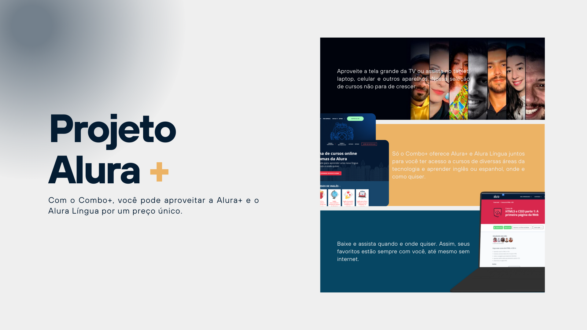

<h1 style="text-align: center">Alura +</h1>

Acesse ao Alura plus e tenha acesso a plataforma e ao alura língua.

## <a href="#status">🚧 Status: Finalizado</a>

### Navegação

- <a href="#functionalities">⚙️ Funcionalidades</a>
- <a href="#tech">💻 Técnicas e tecnologias utilizadas</a>
- <a href="#acess">📁 Acesso ao projeto</a>
- <a href="#run">👨‍💻 Abrir e rodar o projeto</a>
- <a href="#more">📚 Mais informações do curso</a>
- <a href="#licence">✅ Licença</a>

## <a id="functionalities">⚙️ Funcionalidades</a>

O app Alura plus é uma landing page para captar novos clientes. O botões não tem funcionalidades pois o JavaScript não foi aplicado, por isso é apenas um página de leitura com interações com os botões.

## <a id="tech">💻 Técnicas e tecnologias utilizadas</a>

HTML: O HTML foi usado para arquitetar o projeto com uma estrutura bem pensada e semântica para a boa leitura da máquina e um bom desenvolvimento do design do projeto com CSS.

CSS: O CSS tem papel fundamental para indicar a interação do usuário com a interface gráfica: o que são links, tamanhos, acessibilidade, responsividade para que o projeto seja acessado por todos com uma boa experiêcia. Para isso usamos algumas técnicas como:

Flex e Grid
Responsividade
Media Query

## <a id="acess">📁 Acesso ao projeto</a>

Você pode acessar o app clicando [aqui.](https://vagnernatvidade.github.io/alura-plus/ "Alura+")

## <a id="run">👨‍💻 Abrir e rodar o projeto</a>

Para abrir e rodar o projeto, basta clona-lo em sua máquina e abrir o aquivo index.html no navegador.

## <a id="more">📚 Mais informações do curso</a>

Busque na plataforma da Alura o curso HTML e CSS para web: crie páginas dinâmicas publicado na Escola Frontend.

## <a id="licence">✅ Licença</a>

MIT License  
Copyright (c) 2025 Vagner Junior Nativ  
Permissão é concedida, gratuitamente, a qualquer pessoa que obtenha uma cópia deste software...
